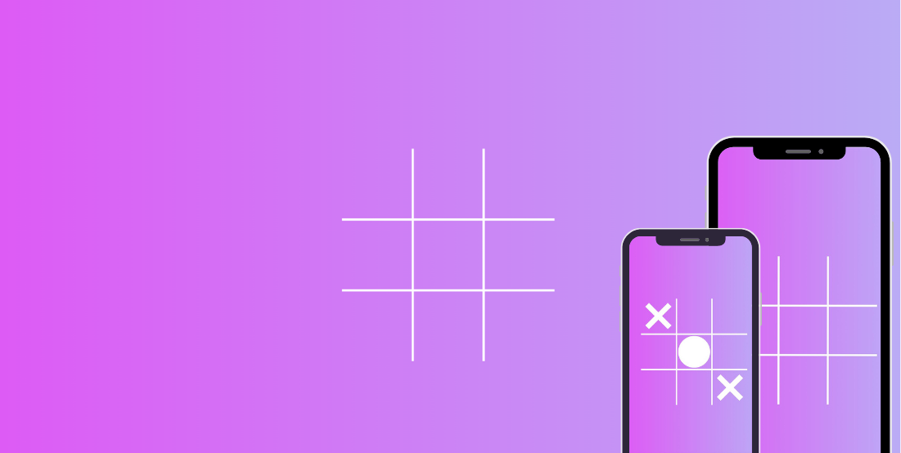
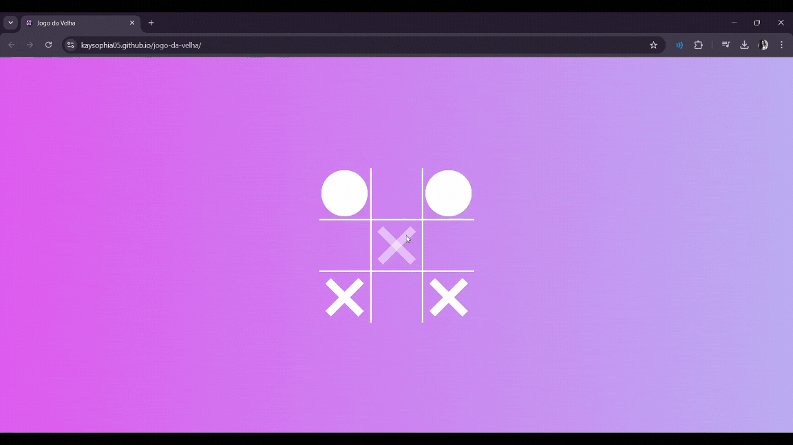

# Jogo da Velha ❌⭕
Um jogo da velha simples e interativo, desenvolvido com HTML, CSS e JavaScript, baseado no conteúdo prático do canal [Felipe Rocha • Full Stack Club](https://www.youtube.com/@FullStackClub).



## 🚀 Funcionalidades
- 🎮 Jogo para dois jogadores (X ou O) 
- 🖥️ Interface responsiva e intuitiva  
- 🔄 Botão para reiniciar a partida  
- 🎉 Indicação do vencedor ou empate 
## 🛠️ Tecnologias Utilizadas 
- HTML  
- CSS  
- JavaScript 
## 📜 Regras do Jogo
1. Dois jogadores se alternam clicando nas células do tabuleiro.  
2. O primeiro a alinhar três símbolos (vertical, horizontal ou diagonal) vence.  
3. Se todas as casas forem preenchidas sem um vencedor, ocorre um empate. 
## Jogo em Ação

## 🔗 Creditos
Projeto desenvolvido com base no conteúdo e orientações de [Felipe Rocha • Full Stack Club](https://www.youtube.com/@FullStackClub), proporcionando grandes aprendizados perante seus vídeos com projetos práticos usando HTML - CSS - JAVASCRIPT 
## 📦 Como Executar  

1. Clone este repositório:  
   ```bash
   git clone https://github.com/kaysophia05/jogo-da-velha.git
   ```
2. Acesse a pasta do projeto:  
   ```bash
   cd jogo-da-velha
   ```
3. Abra o arquivo `index.html` em seu navegador.

## 📌 Considerações
Este projeto foi desenvolvido com o intuito de aprimorar minha lógica de programação e praticar a manipulação do DOM utilizando JavaScript, além de explorar efeitos visuais e interatividade com CSS. A ideia foi integrar essas tecnologias de forma prática, criando um jogo funcional e dinâmico.

Ao longo do desenvolvimento, pude reforçar conceitos essenciais de HTML, CSS e JavaScript, compreendendo melhor a estruturação de código e a interatividade em aplicações web. Esse aprendizado contribui significativamente para minha evolução na área de programação, preparando-me para desafios mais complexos no futuro. 🚀